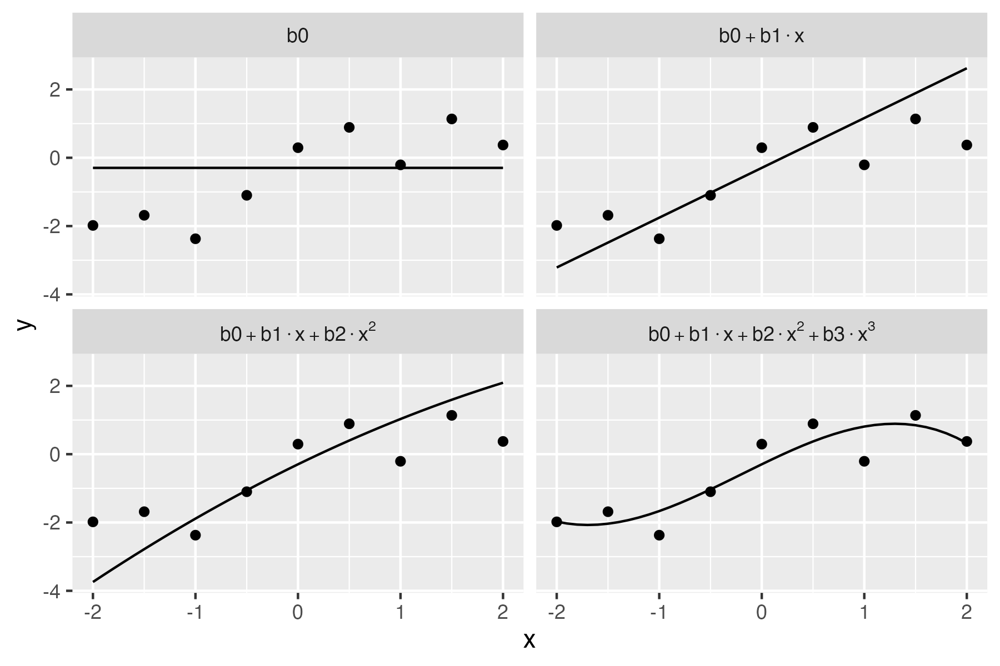

<!-- README.md is generated from README.Rmd. Please edit that file -->

```{r, include = FALSE}
knitr::opts_chunk$set(
  collapse = TRUE,
  comment = "#>",
  fig.path = "man/figures/README-",
  out.width = "100%"
)
```

# fasteval

<!-- badges: start -->

<!-- badges: end -->

This package quickly vectorizes `eval(parse(text = ...))` for standard arithmetic operations. For example, `fasteval("1+2^5")` evaluates to 33. The heavy lifting is done by a recursive C parser written by Lewis Van Winkle, `{tinyexpr}`.

`{fasteval}` also supports both recycled and vectorized variable interpolation for stringsets like `c("x+y", "x-y")` when `x=1` and `y=1:2` (i.e. 2 and -1).

## Installation

You can install the development version of `{fasteval}` from GitHub:

```{r, eval=FALSE}
remotes::install_github("brianwdavis/fasteval")
```

## Basic examples

```{r simple}
library(fasteval)

# Works with simple numeric expressions
fasteval(c("1/3", "2^4"))

# Evaluates variables passed as named args
fasteval(c("x", "y", "x+y"), x = 1, y = 2)

# Evaluates variables passed as a list (or data.frame)
fasteval(
  c("x", "y", "x+y"), 
  list(x = 1, y = 2)
)
```

### Note on vectorization

The vectorization behavior of this function is slightly different from base R. Only length-1 arguments will be recycled. Arguments can be either:

-   all the same length and they'll be evaluated in parallel, or
-   single-length elements and they'll be repeated to the length of the longest argument

This differs from many base R functions, where a length-2 argument would be recycled 3 times to match a length-6 argument.

```{r vectorization}
# All arguments the same length, 3
# 1+4, 2-5, 3*6
fasteval(
  c("x+y", "x-y", "x*y"),
  x = c(1, 2, 3),
  y = c(4, 5, 6)
)

# Arguments either length 3 or 1
# 1+4, 2-4, 3*4
fasteval(
  c("x+y", "x-y", "x*y"),
  x = c(1, 2, 3),
  y = 4
)

# 1+4, 2+5, 3+6
fasteval(
  c("x+y"),
  x = c(1, 2, 3),
  y = c(4, 5, 6)
)
```

If you mix lengths of arguments, you will generate errors.

```{r bad_vectorization, eval=FALSE}
# Lengths 2, 1, 3
# y would be okay here, but the expressions are not
fasteval(
  c("x+y", "x-y"),
  x = c(1, 2, 3),
  y = 4
)
#> Error: Incompatible string length, must be 1 or 3

# Lengths 1, 3, 2
# the expressions would be okay here, but y is not
fasteval(
  "x+y",
  x = c(1, 2, 3),
  y = c(4, 5)
)
#> Error: Incompatible `y` length, must be 1 or 3
```

## Motivating case

Suppose you have generated a list of all possible combinations of moves in a number puzzle (e.g. Countdown, Summle, NYT Digits). An example is included in the dataset `five_moves` for the digits $\{{1, 2, 4, 5, 7, 8}\}$.

```{r game_moves, cache=TRUE}
print(five_moves, max = 10)

results_base <- lapply(five_moves, function(x) eval(parse(text = x)))
print(unlist(results_base), max = 10)

results_fast <- fasteval(five_moves)
print(results_fast, max = 10)
```

```{r benchmark, eval=FALSE}
mb <- microbenchmark::microbenchmark(
  base = lapply(five_moves, function(x) eval(parse(text = x))),
  fasteval = fasteval(five_moves),
  times = 20
)

# execution times in seconds
tibble::as_tibble(summary(mb, "s"))
#>    expr        min     lq   mean median     uq    max neval cld  
#>    <fct>     <dbl>  <dbl>  <dbl>  <dbl>  <dbl>  <dbl> <dbl> <chr>
#>  1 base     14.0   14.3   15.7   15.2   16.1   20.9      20 " b" 
#>  2 fasteval  0.215  0.219  0.234  0.226  0.241  0.291    20 "a " 
```

## Variable interpolation

In addition to the evaluation of numeric operations, this library can resolve the values of variables in the string that are supplied to the function. Let's say you have some candidate model and you want to visually explore how each additional term affects predictions.

$$\ f_0(x) = b_0 + b_1*x + b_2*x^2 + b_3*x^3$$

```{r model}
library(dplyr, quietly = T, warn.conflicts = F)
set.seed(10)

example_df <- 
  tibble(x = seq(-2, 2, by = 0.5)) %>% 
  mutate(y = x + rnorm(length(x)))

example_model <- 
  lm(y~poly(x, 3, raw = T), data = example_df)

coefs <- coef(example_model)
inputs <- expand.grid(
  mods = c("b0", "b0+b1*x", "b0+b1*x+b2*x^2", "b0+b1*x+b2*x^2+b3*x^3"),
  b0 = coefs[1],
  b1 = coefs[2],
  b2 = coefs[3],
  b3 = coefs[4],
  x = seq(-2, 2, by = 0.1)
)

outputs_df <- 
  inputs %>% 
  mutate(
    y = fasteval(
      mods, 
      b0 = b0, b1 = b1, b2 = b2, b3 = b3, x = x
    )
  )

as_tibble(outputs_df)

# equivalent to the bare vector:

outputs <- fasteval(inputs$mods, inputs)
print(outputs, max = 10)

# also equivalent inside a data frame pipeline
#   using the {magrittr} dot pronoun:
#   
# inputs %>% 
#   mutate(y = fasteval(mods, .)) %>% 
#   as_tibble()
```

```{r plotting, eval=FALSE}
library(ggplot2)
# pretty print labels
outputs_df$mods <- 
  stringr::str_replace_all(outputs_df$mods, "\\*", "%.%")

ggplot(outputs_df, aes(x, y)) +
  geom_point(data = example_df) +
  geom_path() +
  facet_wrap(~mods, labeller = label_parsed)
```
<!-- 
native render resolution is low, so manually run above chunk with:
ggsave("man/figures/README-plotting-1.png", width = 6, height = 4)
-->


## Syntax notes
### Supported functions
Most functions are similar to, and return the same values as, functions in R. 

 - **Grouping**: Only parentheses `(`, `)`
 - **Standard infix operators**: 
   - addition `+`
   - subtraction/negation `-`
   - multiplication `*`
   - division `/`
   - exponentiation `^`
   - modulus `%` (equivalent to `%%` in R)
 - **Trigonometric functions**: `cos`, `sin`, `tan`, `acos`, `asin`, `atan`, `atan2`, `cosh`, `sinh`, `tanh`
- **Exponents and logarithms**: `exp`, `ln` (natural log), `log` (also natural log, as in R), `log10`, `pow` (`"pow(x,y)"` is equivalent to `x^y`), `sqrt`
 - **Rounding**: `abs`, `ceil` (`ceiling(x)` in R), `floor`
 - **Combinatorics**:
   - `fac` (`factorial(n)` in R, e.g. `"fac(5)"` returns `120`)
   - `ncr` (combinations, `choose(n,k)` in R, e.g. `"ncr(6,2)"` returns `15`)
   - `npr` (permutations, `choose(n,k)*factorial(k)` in R, e.g. `"npr(6,2)"` returns `30`)
 - **Constants**: `pi`, `e`

### Variable names
Like in R, variable names must start with a letter and contain only `A-Z`, `a-z`, `0-9`, and `_`. Unlike base R, they **cannot** contain `.` and can't be quoted or coerced with backticks if they're non-standard. Names can be arbitrarily long (tested up to 10<sup>8</sup> characters). You can name variables the same as functions or constants (such as `"e"`), and supplied values will take precedence, but this is not best practice.

### Whitespace
Expressions are whitespace agnostic and newlines are allowed.

```{r whitespace}
fasteval("1            +2")

fasteval("
         
         (1   
   )    
            +

  2")

```