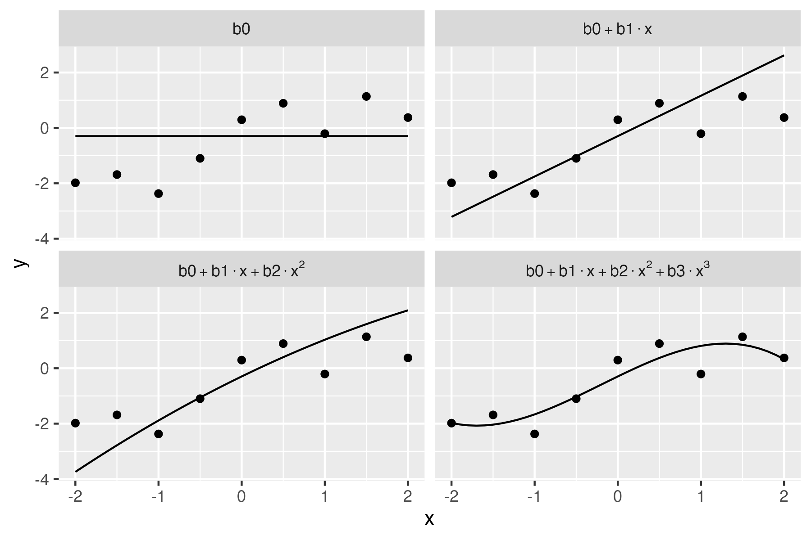

<!-- README.md is generated from README.Rmd. Please edit that file -->

# fasteval

<!-- badges: start -->
<!-- badges: end -->

This package quickly vectorizes `eval(parse(text = ...))` for standard
arithmetic operations. For example, `fasteval("1+2^5")` evaluates to 33.
The heavy lifting is done by a recursive C parser written by Lewis Van
Winkle, `{tinyexpr}`.

`{fasteval}` also supports both recycled and vectorized variable
interpolation for stringsets like `c("x+y", "x-y")` when `x=1` and
`y=1:2` (i.e. 2 and -1).

## Installation

You can install the development version of `{fasteval}` from GitHub:

``` r
remotes::install_github("brianwdavis/fasteval")
```

## Basic examples

``` r
library(fasteval)

# Works with simple numeric expressions
fasteval(c("1/3", "2^4"))
#> [1]  0.3333333 16.0000000

# Evaluates variables passed as named args
fasteval(c("x", "y", "x+y"), x = 1, y = 2)
#> [1] 1 2 3

# Evaluates variables passed as a list (or data.frame)
fasteval(
  c("x", "y", "x+y"), 
  list(x = 1, y = 2)
)
#> [1] 1 2 3
```

### Note on vectorization

The vectorization behavior of this function is slightly different from
base R. Only length-1 arguments will be recycled. Arguments can be
either:

-   all the same length and they’ll be evaluated in parallel, or
-   single-length elements and they’ll be repeated to the length of the
    longest argument

This differs from many base R functions, where a length-2 argument would
be recycled 3 times to match a length-6 argument.

``` r
# All arguments the same length, 3
# 1+4, 2-5, 3*6
fasteval(
  c("x+y", "x-y", "x*y"),
  x = c(1, 2, 3),
  y = c(4, 5, 6)
)
#> [1]  5 -3 18

# Arguments either length 3 or 1
# 1+4, 2-4, 3*4
fasteval(
  c("x+y", "x-y", "x*y"),
  x = c(1, 2, 3),
  y = 4
)
#> [1]  5 -2 12

# 1+4, 2+5, 3+6
fasteval(
  c("x+y"),
  x = c(1, 2, 3),
  y = c(4, 5, 6)
)
#> [1] 5 7 9
```

If you mix lengths of arguments, you will generate errors.

``` r
# Lengths 2, 1, 3
# y would be okay here, but the expressions are not
fasteval(
  c("x+y", "x-y"),
  x = c(1, 2, 3),
  y = 4
)
#> Error: Incompatible string length, must be 1 or 3

# Lengths 1, 3, 2
# the expressions would be okay here, but y is not
fasteval(
  "x+y",
  x = c(1, 2, 3),
  y = c(4, 5)
)
#> Error: Incompatible `y` length, must be 1 or 3
```

## Motivating case

Suppose you have generated a list of all possible combinations of moves
in a number puzzle (e.g. Countdown, Summle, NYT Digits). An example is
included in the dataset `five_moves` for the digits
.

``` r
print(five_moves, max = 10)
#>  [1] "((((1*2)*4)-5)*7)-8" "((((1*2)*4)-5)*7)*8" "((((1*2)*4)-5)*7)+8"
#>  [4] "((((1*2)*4)-5)*8)-7" "((((1*2)*4)-5)*8)*7" "((((1*2)*4)-5)*8)+7"
#>  [7] "((((1*2)*4)-5)+7)-8" "((((1*2)*4)-5)+7)*8" "((((1*2)*4)-5)+7)+8"
#> [10] "((((1*2)*4)-5)+8)-7"
#>  [ reached getOption("max.print") -- omitted 463154 entries ]

results_base <- lapply(five_moves, function(x) eval(parse(text = x)))
print(unlist(results_base), max = 10)
#>  [1]  13 168  29  17 168  31   2  80  18   4
#>  [ reached getOption("max.print") -- omitted 463154 entries ]

results_fast <- fasteval(five_moves)
print(results_fast, max = 10)
#>  [1]  13 168  29  17 168  31   2  80  18   4
#>  [ reached getOption("max.print") -- omitted 463154 entries ]
```

``` r
mb <- microbenchmark::microbenchmark(
  base = lapply(five_moves, function(x) eval(parse(text = x))),
  fasteval = fasteval(five_moves),
  times = 20
)

# execution times in seconds
tibble::as_tibble(summary(mb, "s"))
#>    expr        min     lq   mean median     uq    max neval cld  
#>    <fct>     <dbl>  <dbl>  <dbl>  <dbl>  <dbl>  <dbl> <dbl> <chr>
#>  1 base     14.0   14.3   15.7   15.2   16.1   20.9      20 " b" 
#>  2 fasteval  0.215  0.219  0.234  0.226  0.241  0.291    20 "a " 
```

## Variable interpolation

In addition to the evaluation of numeric operations, this library can
resolve the values of variables in the string that are supplied to the
function. Let’s say you have some candidate model and you want to
visually explore how each additional term affects predictions.

 = b_0 + b_1*x + b_2*x^2 + b_3*x^3")

``` r
library(dplyr, quietly = T, warn.conflicts = F)
#> Warning: package 'dplyr' was built under R version 4.2.3
set.seed(10)

example_df <- 
  tibble(x = seq(-2, 2, by = 0.5)) %>% 
  mutate(y = x + rnorm(length(x)))

example_model <- 
  lm(y~poly(x, 3, raw = T), data = example_df)

coefs <- coef(example_model)
inputs <- expand.grid(
  mods = c("b0", "b0+b1*x", "b0+b1*x+b2*x^2", "b0+b1*x+b2*x^2+b3*x^3"),
  b0 = coefs[1],
  b1 = coefs[2],
  b2 = coefs[3],
  b3 = coefs[4],
  x = seq(-2, 2, by = 0.1)
)

outputs_df <- 
  inputs %>% 
  mutate(
    y = fasteval(
      mods, 
      b0 = b0, b1 = b1, b2 = b2, b3 = b3, x = x
    )
  )

as_tibble(outputs_df)
#> # A tibble: 164 × 7
#>    mods                      b0    b1     b2     b3     x      y
#>    <fct>                  <dbl> <dbl>  <dbl>  <dbl> <dbl>  <dbl>
#>  1 b0                    -0.296  1.46 -0.132 -0.221  -2   -0.296
#>  2 b0+b1*x               -0.296  1.46 -0.132 -0.221  -2   -3.21 
#>  3 b0+b1*x+b2*x^2        -0.296  1.46 -0.132 -0.221  -2   -3.74 
#>  4 b0+b1*x+b2*x^2+b3*x^3 -0.296  1.46 -0.132 -0.221  -2   -1.97 
#>  5 b0                    -0.296  1.46 -0.132 -0.221  -1.9 -0.296
#>  6 b0+b1*x               -0.296  1.46 -0.132 -0.221  -1.9 -3.07 
#>  7 b0+b1*x+b2*x^2        -0.296  1.46 -0.132 -0.221  -1.9 -3.54 
#>  8 b0+b1*x+b2*x^2+b3*x^3 -0.296  1.46 -0.132 -0.221  -1.9 -2.03 
#>  9 b0                    -0.296  1.46 -0.132 -0.221  -1.8 -0.296
#> 10 b0+b1*x               -0.296  1.46 -0.132 -0.221  -1.8 -2.92 
#> # ℹ 154 more rows

# equivalent to the bare vector:

outputs <- fasteval(inputs$mods, inputs)
print(outputs, max = 10)
#>  [1] -0.2962312 -3.2125450 -3.7416141 -1.9744564 -0.2962312 -3.0667293
#>  [7] -3.5442142 -2.0290974 -0.2962312 -2.9209136
#>  [ reached getOption("max.print") -- omitted 154 entries ]

# also equivalent inside a data frame pipeline
#   using the {magrittr} dot pronoun:
#   
# inputs %>% 
#   mutate(y = fasteval(mods, .)) %>% 
#   as_tibble()
```

``` r
library(ggplot2)
# pretty print labels
outputs_df$mods <- 
  stringr::str_replace_all(outputs_df$mods, "\\*", "%.%")

ggplot(outputs_df, aes(x, y)) +
  geom_point(data = example_df) +
  geom_path() +
  facet_wrap(~mods, labeller = label_parsed)
```

<!-- 
native render resolution is low, so manually run above chunk with:
ggsave("man/figures/README-plotting-1.png", width = 6, height = 4)
-->



## Syntax notes

### Supported functions

Most functions are similar to, and return the same values as, functions
in R.

-   **Grouping**: Only parentheses `(`, `)` are allowed
-   **Standard infix operators**:
    -   addition `+`
    -   subtraction/negation `-`
    -   multiplication `*`
    -   division `/`
    -   exponentiation `^`
    -   modulus `%` (equivalent to `%%` in R)
-   **Trigonometric functions**: `cos`, `sin`, `tan`, `acos`, `asin`,
    `atan`, `atan2`, `cosh`, `sinh`, `tanh`
-   **Exponents and logarithms**: `exp`, `ln` (natural log), `log` (also
    natural log, as in R), `log10`, `pow` (`"pow(x,y)"` is equivalent to
    `x^y`), `sqrt`
-   **Rounding**: `abs`, `ceil` (`ceiling(x)` in R), `floor`
-   **Combinatorics**:
    -   `fac` (`factorial(n)` in R, e.g. `"fac(5)"` returns `120`)
    -   `ncr` (combinations, `choose(n,k)` in R, e.g. `"ncr(6,2)"`
        returns `15`)
    -   `npr` (permutations, `choose(n,k)*factorial(k)` in R,
        e.g. `"npr(6,2)"` returns `30`)
-   **Constants**: `pi`, `e`

### Variable names

1.  Like in R, variable names must start with a letter and contain only
    `A-Z`, `a-z`, `0-9`, and `_`. Unlike base R, they **cannot** contain
    `.` and can’t be quoted or coerced with backticks if they’re
    non-standard.
2.  Names can be arbitrarily long (tested up to 10<sup>8</sup>
    characters).
3.  You can name variables the same as functions or constants (such as
    `"e"`), and supplied values will take precedence, but this is not
    best practice.
4.  Additionally, there are two protected variable names, `strings` and
    `quiet`, since they are the formal arguments of the function. If you
    need to use those as variable names, the values can be wrapped up
    inside a list:

``` r
fasteval("strings+quiet", strings = 1, quiet = 1)
#> Error in fasteval("strings+quiet", strings = 1, quiet = 1): Variable arguments should be named

fasteval("strings+quiet", list(strings = 1, quiet = 1))
#> [1] 2
```

### Whitespace

Expressions are whitespace agnostic and newlines are allowed.

``` r
fasteval("1            +2")
#> [1] 3

fasteval("
         
         (1   
   )    
            +

  2")
#> [1] 3
```

### Known bugs

1.  Expressions of the form `"(x)^0` correctly return 1 when x≥0, but
    incorrectly return -1 when x\<0.
    <https://github.com/codeplea/tinyexpr/issues/52>
2.  Compiling from source on Windows will result in WARNINGs related to
    the flag `-Warray-bounds`. The package works as intended however and
    passes tests for local use.
    <https://github.com/codeplea/tinyexpr/issues/87>
